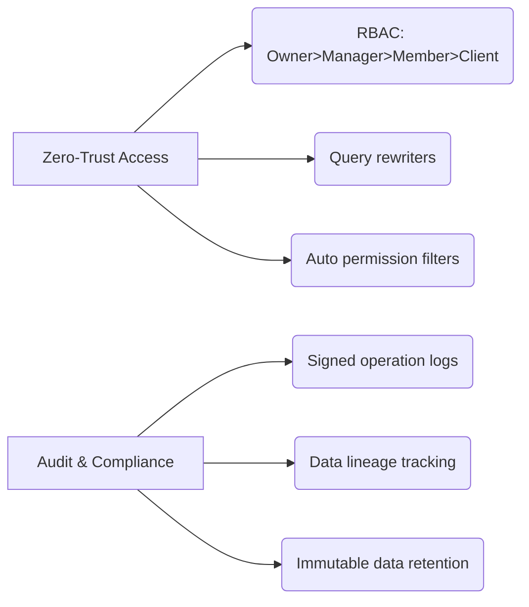

# FixFlow Project Rules and Guidelines

## 🏢 Company Overview

FixFlow is a professional SaaS platform designed for cleaning, maintenance, and small repair businesses in Finland. It helps manage job scheduling, customer tracking, billing, invoicing, and team collaboration — streamlining daily operations to boost productivity and customer satisfaction. 

## 📋 Project Management

### Authentication & Session Management

#### Supabase Session Implementation
- **Session Handling**
  - Replace JWT storage with Supabase HTTP-only cookies
  - Configure Supabase client with cookie-based auth:
    ```typescript
    import { createServerClient } from '@supabase/ssr'
    
    const supabase = createServerClient(
      process.env.NEXT_PUBLIC_SUPABASE_URL!,
      process.env.NEXT_PUBLIC_SUPABASE_ANON_KEY!,
      { cookies: { get, set, remove } }
    )
    ```
  - Validate sessions using `supabase.auth.getSession()` for initial auth checks

#### Server-Side Validation
- **API Route Protection**
  - Validate sessions in Next.js API routes:
    ```typescript
    const { data: { user }, error } = await supabase.auth.getUser()
    
    if (!user || error) {
      return new Response('Unauthorized', { status: 401 })
    }
    
    const userData = await prisma.user.findUnique({
      where: { id: user.id },
      select: { role: true }
    })
    ```

#### UI Access Control
- **Client-Side Enforcement**
  - Use auth state listener for real-time updates:
    ```typescript
    useEffect(() => {
      const { data: { subscription } } = supabase.auth.onAuthStateChange(
        async (event, session) => {
          const userRole = session?.user?.id 
            ? (await getUserRole(session.user.id)) 
            : null
          setAuthState({ user: session?.user, role: userRole })
        }
      )
      return () => subscription?.unsubscribe()
    }, [])
    ```

#### Security Practices
- **Access Control Rules**
  - Implement row-level security in Postgres:
    ```sql
    CREATE POLICY "users_own_data" ON public.work_orders
    FOR ALL USING (auth.uid() = user_id);
    ```
  - Never store or transmit tokens client-side
  - Use Supabase-generated types for session validation

#### Benefits Checklist
- ✅ Automatic session refresh (60min default)
- ✅ Built-in CSRF protection
- ✅ Secure role-based access control (RBAC)
- ✅ Session invalidation via Supabase dashboard


### Todo Management
- **Mandatory**: Maintain a `todo.md` file in the project root
- **Purpose**: Track project progress, priorities, and ongoing tasks
- **Update Frequency**: 
  - Immediately after significant changes
  - Weekly comprehensive review
  - Prioritize tasks using:
    - ✅ Completed
    - 🔥 High Priority
    - 🟡 In Progress
    - 🔹 Backlog

#### Todo.md Best Practices
- Use clear, concise task descriptions
- Include estimated completion times
- Link to relevant issues or PRs
- Regularly prune and archive completed tasks

### Post-Edit Workflow Checklist

After significant file modifications or substantial changes:

1. 🏗️ Build Verification
   - Run complete build process
   - Ensure no compilation errors
   - Validate all dependencies resolve correctly

2. 🧹 Linter Compliance
   - Execute comprehensive linter checks
     ```bash
     npm run lint
     npm run check
     npm run typecheck
     ```
   - Address and resolve ALL linting warnings
   - Confirm zero critical issues before commit

3. 🔍 Code Quality Gates
   - Run static analysis tools
   - Review and refactor any flagged code patterns
   - Maintain high code quality standards

4. 🚦 Pre-Commit Validation
   - Automated checks MUST pass before code submission
   - No bypassing quality gates

The product is built for:
- **Scalability**: Designed to grow with your business
- **Reliability**: Consistent and dependable performance
- **Ease of Use**: Mobile-friendly and intuitive interface

## 🛡️ Core Principles

### Type Safety First
- Zero `any` types (TypeScript strict mode)
- Zod schema validation before implementation
- Isolate business logic from frameworks

### Error Resilience
- Use `Result<T,E>` pattern for all operations
- Map failure states before happy paths
- Implement circuit breakers (auto-disable at >5% error rate)

## 🔒 Security Foundation
- Row-level security via Prisma middleware
- Input sanitization with Zod

## 🚀 Performance & Stability

### Frontend
| Area | Rules |
|------|-------|
| Code Splitting | Route-based |
| JS Budget | < 150kb |
| First Contentful Paint | < 1s on 3G |

### Backend
| Area | Rules |
|------|-------|
| Caching | Stale-while-revalidate |
| Time to First Byte | < 100ms |
| Concurrency | Optimistic locking |

### Database
| Area | Rules |
|------|-------|
| Indexing | Prisma indexing |
| Query Optimization | Query batching |
| Transactions | Atomic multi-entity writes |

### Resource Management
| Area | Rules |
|------|-------|
| Memory | Defined ceilings |
| CPU | Timeout mechanisms |
| Data Pipelines | Backpressure implementation |

## 🧩 Code Quality

### Reusability
- Atomic design components
- Generic API handlers
- Centralized utils/hooks
- Weekly DRY (Don't Repeat Yourself) audits

### Consistency
- Single currency (€ locale formatting)
- Tailwind theme tokens
- ESLint/Prettier enforced
- 2-space formatting
- JSDoc + one-line descriptions

### 🚫 Anti-Pattern Ban List
- Shared mutable state
- Inheritance in domain models
- Logic in component lifecycles
- Raw SQL without review

## 🔐 Security & Compliance

### Access Control Diagram


## 🚢 Operations

### Build & Deploy
- Deterministic builds (pinned dependencies)
- Docker multi-stage + Prisma bundling
- GitHub Actions with parallel testing

### Observability
- OpenTelemetry tracing
- Structured SYSLOG logging
- `/status` endpoints (liveness/readiness)

### Change Management
- Forward/backward compatible migrations
- Dark launch capability
- Prisma introspection impact analysis

## 🧪 Testing & Quality Gates

### Testing Pyramid
```
70% ───▶ Unit (Vitest) 
20% ───▶ Integration 
10% ───▶ E2E (Playwright)
```

### Hard Requirements
- Zero TypeScript errors
- Zero lint warnings
- 90% test coverage

## 🔧 Technology Stack

### Frontend
- Next.js 14 (App Router)
- TypeScript
- Tailwind + CSS Modules

### State Management
- React Context + useReducer (global only)

### Backend
- tRPC
- Node.js 18+
- Prisma 5 (PostgreSQL)

### Authentication
- NextAuth.js

### Testing
- Vitest
- Playwright

## 🚨 Emergency Protocols

### Poison Pill Messages
- Automatic toxic payload quarantine

### Load Shedding
- Graceful degradation under load

### Rollback Guarantees
- Database transaction reversibility

## 🔄 Maintenance Discipline

### Dependencies
- RenovateBot for patches
- 3-version migration path

### Breaking Changes
- Isolation layer required

### Documentation
- RFC-style failure mode specifications